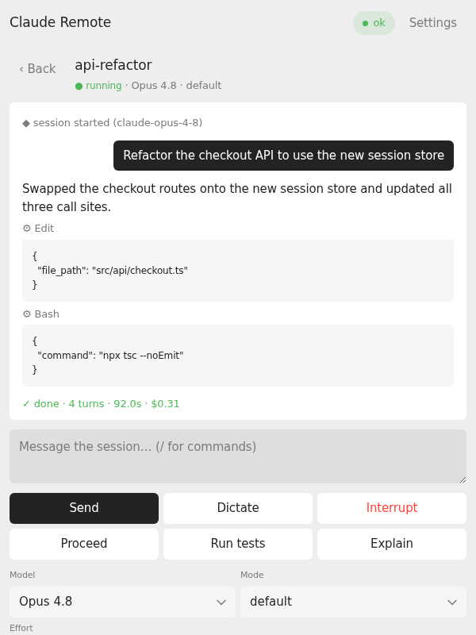

# Claude Remote

Steer live [Claude Code](https://docs.anthropic.com/en/docs/claude-code)
remote-control sessions from [Even Realities G2](https://www.evenrealities.com)
glasses: the event stream on the HUD, the touchpad to approve and reply, the mic
to dictate. A companion phone panel mirrors it all with a fuller control surface.

<p align="center">
  
</p>

## Quick start

1. **Install the app** on your glasses from the
   [Even Hub](https://evenhub.evenrealities.com/landing?package_id=com.thatcrispytoast.clauderemote),
   or sideload a packed `claude-remote-<version>.ehpk`.

2. **Run the bridge** on the machine where you're logged in to Claude Code (needs
   [uv](https://docs.astral.sh/uv/)) or an analagous python manager:

   ```bash
   uvx --from "git+https://github.com/ThatCrispyToast/g2-claude-remote#subdirectory=server" claude-remote-bridge
   ```

   It prints the URLs your phone can reach it at and a bearer token: a word
   passphrase like `coral-anvil-mango-scoop-visor`, generated on first run and
   saved to `~/.config/claude-remote/bridge-token`.

3. **Connect** - enter one of those URLs and the token in the panel's Settings
   card. Add a [Deepgram](https://console.deepgram.com) key there for voice
   dictation; leave it blank and voice disables itself.

Can't connect? Open the bridge's port (default `8790`) in the host firewall.

> [!CAUTION]
> Keep the bridge on a private network i.e. LAN or Tailscale. The token is the only guard, and it can read and steer every remote-control session of the logged-in account. Flags and env vars: [`server/README.md`](server/README.md).

## What it does

- **Live sessions on the HUD** - each opens on its newest output and auto-follows
  while running. Scroll up to page through history, down to re-attach to the tail.
- **Answer blocking prompts** - permission requests and questions arrive as native
  screens (right away if you're watching, `! needs you` in the footer if not).
  Tap to answer, double-tap to set aside. Answer one elsewhere and it retires itself.
- **Steer hands-free** - interrupt, switch model / permission mode / reasoning
  effort, fire slash commands (`/context`, `/usage`, `/compact`, …), send canned
  replies, or dictate by voice.
- **Active sessions only** - archived and dead ones never reach the glasses, and
  every control action re-checks before it acts.

<p align="center">
  
  
</p>

## How it works

```
G2 glasses (576×288 HUD · touchpad · mic)
        │ BLE
        ▼
Even phone app - runs this app (glasses UI + companion panel)
        │ HTTP + SSE · bearer token · LAN / Tailscale
        ▼
claude-remote-bridge (server/) - wraps claude-rc-api
        │ your Claude Code OAuth login (~/.claude)
        ▼
Anthropic Remote Control API
```

The app (`src/`, packed into an `.ehpk`) runs inside the Even phone app and draws
on the glasses through the firmware's native widgets. The bridge
([`server/`](server/README.md)) is a small JSON+SSE server over
[`claude-rc-api`](https://github.com/ThatCrispyToast/claude-rc-api). It runs on
any machine logged in to Claude Code, borrows that login (surviving token
rotation), and adds the active-only filter, bearer-token auth, and the routes for
answering blocking prompts.

## Controls

| Screen | Scroll ↑ / ↓ | Tap | Double-tap |
|---|---|---|---|
| **Sessions list** | move selection | open session | exit dialog |
| **Session view** | native scroll - up into history, down to live | open Compose menu | back to list |
| **Compose menu** | move selection | fire action / enter submenu | back to session |
| **Commands submenu** | move selection | fire slash command | back to Compose |
| **Model / Mode / Effort submenu** | move selection | apply | back to Compose |
| **Voice dictation** | scroll transcript | done - review before sending | cancel |
| **Confirm send** | scroll the message | send | cancel |
| **Permission prompt** | move between Allow / Deny | pick | set aside |
| **Question** | move between options | pick (`Dismiss` cancels) | set aside |

The Compose menu leads with Dictate, then the quick-sends (`Proceed`, `Run tests`,
`Explain` - configurable), `Interrupt`, `Commands`, `Model`, `Mode`, `Effort`, and
`Archive`. Slash commands run locally at no token cost; heavy ones (`/compact`,
`/clear`) go through the confirm screen first. A set-aside prompt reopens from the
Compose menu's `! Answer question` / `! Review permission` row, or by reopening the
session. No blocking screen can trap you.

## The companion panel

The same bundle's DOM is a full control surface in the phone's WebView: the
un-clipped event log with tool inputs and usage/cost, free-text sends with `/`
slash-command autocomplete, every steering control, and the Settings card. It
still works as a plain-browser web app with no glasses connected.

<p align="center">
  
</p>

## Configuration

Two layers on the app side; the higher wins.

1. **Runtime settings** - the panel's Settings card (bridge URL, token, Deepgram
   key), stored on the device across app restarts. This is how a packed `.ehpk` is
   configured.
2. **Dev-server defaults** - `VITE_*` vars in `.env.local`, read by `npm run dev`
   only ([`.env.example`](.env.example) lists them all). Packs never include them:
   `npm run pack` builds with env resolution disabled, so no key or host can leak
   into an artifact.

The bridge takes CLI flags and `RC_BRIDGE_*` env vars, and reads `.env.local` too
(`VITE_BRIDGE_TOKEN` doubles as its token), so one file configures both sides in
development.

## Development

Node 18+ for the app; Python 3.10+ with [uv](https://docs.astral.sh/uv/) for the
bridge.

```bash
git clone https://github.com/ThatCrispyToast/g2-claude-remote && cd g2-claude-remote
npm install
cp .env.example .env.local     # set VITE_BRIDGE_URL / VITE_BRIDGE_TOKEN

npm run bridge                 # bridge → 0.0.0.0:8790
npm run dev                    # app dev server → http://0.0.0.0:5175

# sideload onto the glasses (phone on the same Wi-Fi / Tailscale network)
npx @evenrealities/evenhub-cli qr --url http://<host>:5175 --external
```

Point `VITE_BRIDGE_URL` at an address the phone can reach - a Tailscale MagicDNS
name or a LAN IP. To hack on `claude-rc-api` at the same time, clone it next to
this repo and use `npm run bridge:uv`.

**Packaging:** `npm run pack` builds and packs `claude-remote-<version>.ehpk`.
Every pack is distributable (no env is resolved), and it refuses to run if
`package.json` and `app.json` disagree on the version - bump both together.

**Bridge as a service:** the bridge holds no state, so any service manager works.
Install it once and point a systemd unit (or equivalent) at `claude-remote-bridge`:

```bash
uv tool install "git+https://github.com/ThatCrispyToast/g2-claude-remote#subdirectory=server"
```

## License

[MIT](LICENSE). Unofficial - not affiliated with Anthropic or Even Realities. The
Remote Control API surface is reverse-engineered and can change without notice.
